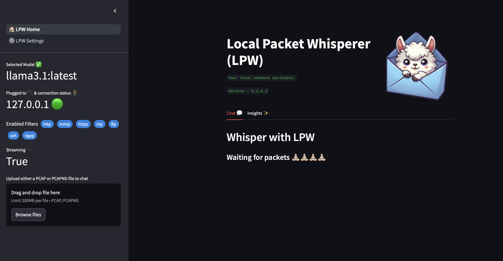

# Local Packet Whisperer (LPW)

Local Packet Whisperer (LPW) is an innovative project designed to facilitate local and private interactions with PCAP/PCAG NG files using a combination of Ollama, Streamlit, and PyShark. This tool serves as a 100% local assistant powered by customizable local large language models (LLMs), with features including Streamlit for the front end and PyShark for packet parsing, LPW is easily installable via pip, allowing users to seamlessly connect to an Ollama server over a network

[](https://pepy.tech/project/lpw) [](https://pepy.tech/project/lpw)

[](https://doi.org/10.5281/zenodo.14251995)

If you are using this project as part of your research, kindly consider citing this project as follow:

```
[1]V. Kumar, “Local Packet Whisperer (LPW)”. Zenodo, Nov. 30, 2024. doi: 10.5281/zenodo.14251995.
```

## Features

1) 100% local, private PCAP assistant powered by range of local LLMs at your control, powered by Ollama
2) Uses streamlit for the FE and pyshark for the pcap parsing needs
3) Available as a pip installable package. So just *pip it away!* 😎
4) Connect LPW to a Ollama server running over a network.
5) Experimental Support for Agentic Insights `(NGAP only for now).`



### Refer [Release History](https://github.com/kspviswa/local-packet-whisperer/releases) for more details info on what each release contains.

## Star History

[](https://star-history.com/#kspviswa/local-packet-whisperer&Timeline)

## Stay Updated!
📬 [Subscribe to my Substack](https://viswakumar.substack.com/t/lpw) to get notified about new releases

## Requirements

1) Download & Install [Ollama](https://ollama.ai) by referring to instructions according to your OS [here](https://ollama.com/download)

2) Pull any Chat based LLM models to use with LPW.
```
ollama pull dolphin-mistral:latest
```
3) If not running the desktop application, Start Ollama Server (refer [here](https://github.com/ollama/ollama?tab=readme-ov-file#start-ollama))

4) You also need to install `tshark` executable. You could either install the [Wireshark Application](https://www.wireshark.org/download.html) or simply use `brew install tshark`. 

    <details>
    <summary>⚠️Warning⚠️ If you don't perform this step, you may see below error</summary>

    ```
    TSharkNotFoundException: TShark not found. Try adding its location to the configuration file.
    ```
    </details> 


## Installation & Usage

1) Install/Upgrade *LPW* using pip
```
pip install -U lpw
```

2) This will install `lpw` CLI in your machine. Now simply Start or Stop LPW as follows:

```
lpw {start or stop}
lpw -h #for help
```

Refer [User Guide](https://github.com/kspviswa/local-packet-whisperer/wiki/User-Guide-(old-releases)) for more details.

## Local Development

1) Clone this repo and install requirements
```
git clone https://github.com/kspviswa/local-packet-whisperer.git
python3 -m venv .venv
source .venv/bin/activate
pip install -r requirements.txt
```
2) Run streamlit app & point to `http://localhost:8501`
```
streamlit run bin/lpw_main.py
```
or simply
```
<lpw dir>/bin/lpw {start or stop}
```

## Contributions

I just created this project based on inspiration from similar project called [Packet Buddy](https://github.com/automateyournetwork/packet_buddy) which used open AI. But if you find this useful and wanna contribute bug fixes, additional features feel free to do so by raising a PR or open issues for me to fix. I intend to work on this as a hobby unless there is some interest in the community.
